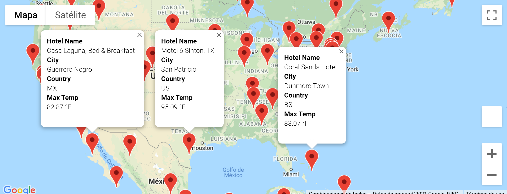
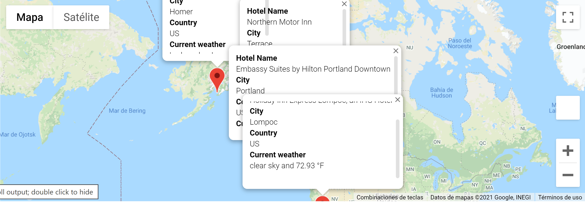

# World_Weather_Analysys

Source: https://gfycat.com/fondanchoredgoose

## Project Overview
In this module, we put into practice our analysis, visualization, and statistical skills by retrieving and analyzing weather data for a hypothetical travel company, PlanMyTrip.

## Tools and APIs
Python, citipy, Pandas, Matplotlib, SciPy, Google Maps API, Google Places API, OpenWeatherMap API, and Jupyter Notebook.

## Weather Database
Weather_Database uses Open Weather Map API to pull weather information on over 743 different cities around the world. That information consists of:
1.	Maximum Temperature
2.	Cloudiness
3.	Wind Speed
4.	Humidity
5.	Current Weather Description

Also, We generate a set of 2,000 random latitudes and longitudes, retrieve the nearest city, and perform an API.

## Vacation Search
We used Google Maps API to plot different travel destinations with a hotel at each location. Furthermore, the image below shows the locations of all the places in the database that have a daily maximum temperature between 50 and 120 degrees.

## Vacation Itinerary
We used Google Maps directions API to create a vacation itinerary. For example, the image below shows a 5 stop itinerary( Lompoc, Fortuna, Portland, Terrace, and Homer)between the United States and Canada.

Also, we create another map to show a hotel at each location.

