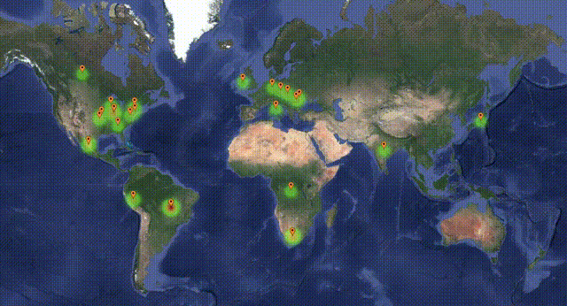

# World_Weather_Analysys

Source: https://gfycat.com/fondanchoredgoose

## Project Overview
In this module, we put into practice our analysis, visualization, and statistical skills by retrieving and analyzing weather data for a hypothetical travel company, PlanMyTrip.

## Tools and APIs
Python, citipy, Pandas, Matplotlib, SciPy, Google Maps API, Google Places API, OpenWeatherMap API, and Jupyter Notebook.

